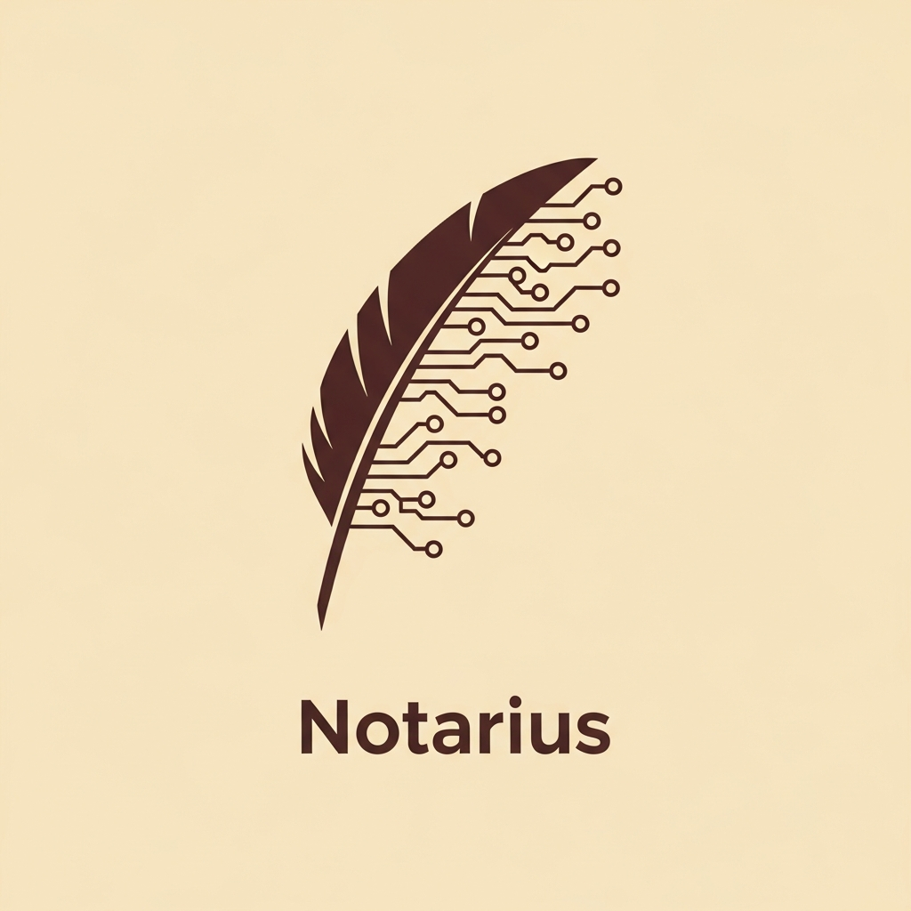

<div align="center">
<a href="https://github.com/artpods56/KUL_Notarius" title="TrendRadar">
  
</a>

**Historical Schematism Indexing & Extraction Engine**

[](https://www.python.org/downloads/)
[](https://github.com/beartype/beartype)
[](https://github.com/pre-commit/pre-commit)
[](https://github.com/astral-sh/ruff)
[](https://opensource.org/licenses/MIT)

</div>

## About

**Notarius** is a specialized  data extraction service built at the Centre for Medieval Studies in Lublin. 

## Quick Start

**Prerequisites:** Python 3.12+, Docker, CUDA capable GPU (for local OCR inference)

```bash
# Install dependencies
uv sync

# Set up environment
cp .env.example .env

# Install pre-commit hooks
pre-commit install

# Run tests
uv run pytest
```

## Documentation

- [Installation Guide](docs/INSTALLATION.md) - Detailed setup instructions for different environments
- [Technical documentation](docs/TECHNICAL_DOCUMENTATION.md) - Explanation of the indexing and extraction strategies
- [Contributing](docs/CONTRIBUTING.md) - How to contribute to the project
- [Conventional Commits](docs/CONVENTIONAL_COMMITS.md) - Commit message conventions
- [Architecture](docs/ARCHITECTURE.md) - System design and ETL pipeline structure

## License

MIT License - see [LICENSE](LICENSE) file for details.
```